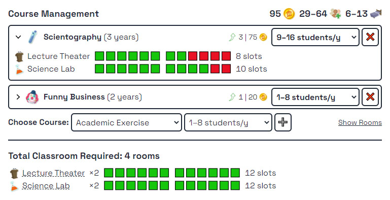

# Two Point Campus Course Planner

This tool will help you to plan your perfect course combination for your campus. This is done with a simple mathematical calculation. In practice, however, you might have to fight with your timetable scheduler.

If you found any problems, please feel free to open an issue. All contributions are welcome. The icons are from [Two Point Campus Wiki](https://two-point-campus.fandom.com/wiki/Two_Point_Campus_Wiki).
